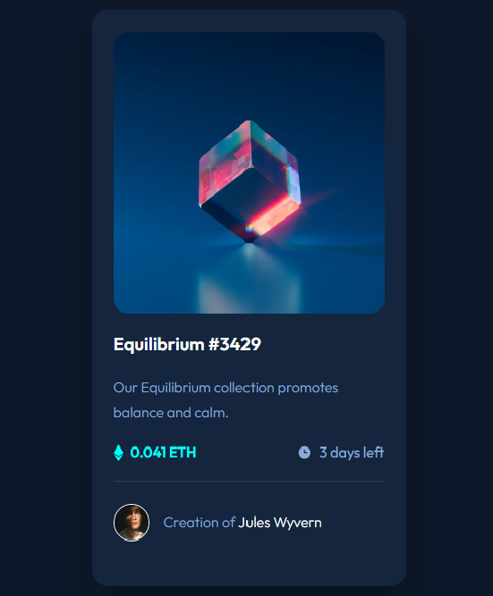
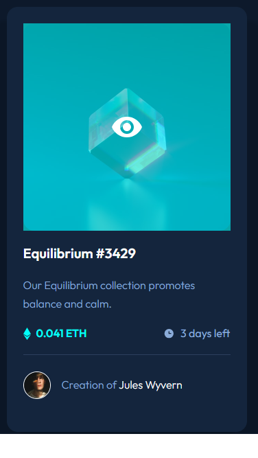

# Frontend Mentor - NFT preview card component solution

This is a solution to the [NFT preview card component challenge on Frontend Mentor](https://www.frontendmentor.io/challenges/nft-preview-card-component-SbdUL_w0U).

## Table of contents

- [Overview](#overview)
  - [The challenge](#the-challenge)
  - [Screenshot](#screenshot)
- [My process](#my-process)
  - [Built with](#built-with)
  - [What I learned](#what-i-learned)


**Note: Delete this note and update the table of contents based on what sections you keep.**

## Overview

### The challenge

Users should be able to:

- View the optimal layout depending on their device's screen size
- See hover states for interactive elements

### Screenshot


Desktop:  


Mobile:



## My process

### Built with

- Semantic HTML5 markup
- CSS custom properties
- Flexbox
- CSS Grid
- Mobile-first workflow


### What I learned


```html
<picture class="nft__image">
    
      <div>
          
      </div>
</picture>
```

```css
.nft__image div{
    opacity:0;
    position: absolute;
    top:0;
    background-color: hsla(178, 100%, 50%, 0.6);
    width: 100%;
    height: 100%;
    z-index: 2;
}

.nft__image div:hover{
    opacity: 1;
    cursor: pointer;
}
```
